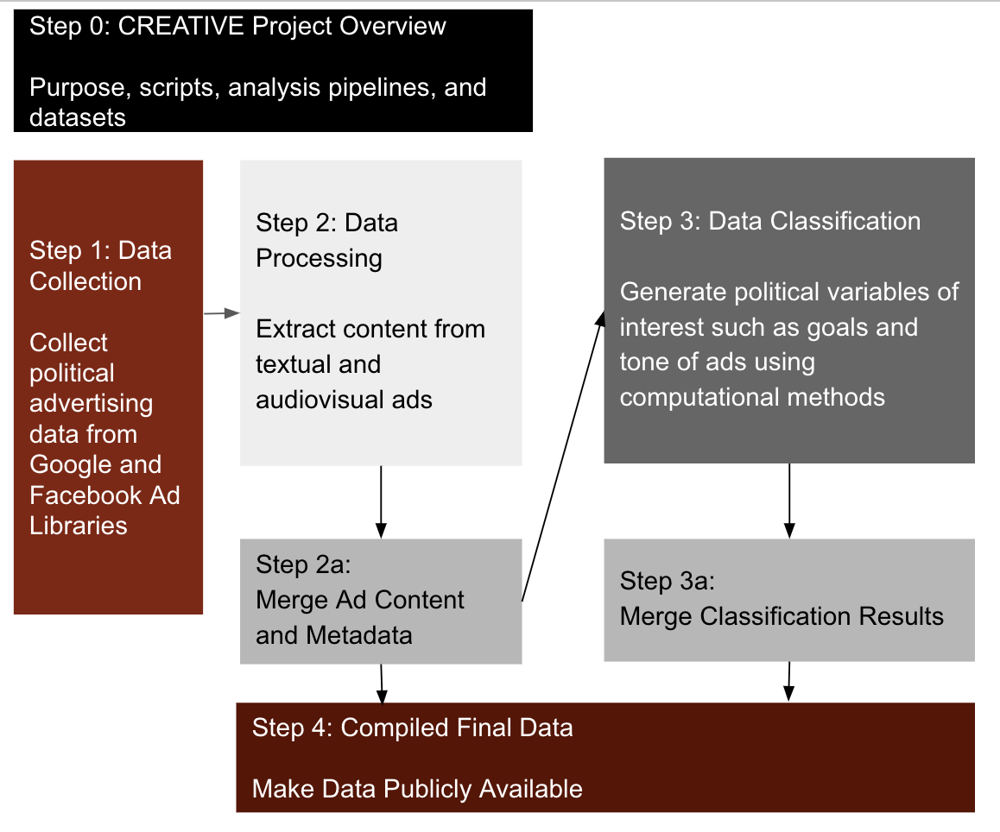

 # Wesleyan Media Project - Image-Video-Data-Preparation 

Welcome! This repository is part of the Cross-platform Election Advertising Transparency initiative (CREATIVE) project. CREATIVE is a joint infrastructure project of WMP and privacy-tech-lab at Wesleyan University. CREATIVE provides cross-platform integration and standardization of political ads collected from Google and Facebook.

This repository is part of the Data Processing step.

## Table of Contents

- [Introduction](#introduction)
- [Objective](#objective)
- [Data](#data)
- [Setup](#setup)

## Introduction
This repository contains code that allows for selecting and preprocessing image and video data for the AWS Rekognition pipeline, as well as querying text ads data.

Specifically, it contains scripts for video and image data preprocessing through deduplication, ads content filtering (for image data), and video trimming (in order to economize computational resources). It also provides scripts which allow users to retrieve metadata for video and image ads from their Google BigQuery table and text ads from their MySQL table (set up during the data collection step [Facebook](https://github.com/Wesleyan-Media-Project/fb_agg_reports_import/tree/main), [Google](https://github.com/Wesleyan-Media-Project/google_ads_archive)). Additionally, a script that selects text ads data is also provided. 

## Objective
Each of our repositories belongs to one or more of the the following categories:
- Data Collection
- Data Processing
- Data Classification
- Compiled Final Data

This repository is part of the Data Processing section.

## Data
The data created by `01-get-checksum-for-deduplication.ipynb` and `02-filter-data-for-audiovisual-analysis.ipynb` is in .csv format. `select-ad-metadata` folder stores three database query scripts. `get_fb_metadata_and_text_ads.R` and `get_google_text_ads.R` select and save query results tables into .csv files. The data returned by `get_google_metadata.sql` is a result table on Google BigQuery, which can be exported and saved into a .csv file. 

The data created by `01-get-checksum-for-deduplication.ipynb` (saved as either `outfile.csv`, `google2022_video_info.csv` or `google2022_image_info'.csv` contains the following fields:  

filepath : the file path to get to the file being referenced  
filename : the file name of the file being referenced  
checksum : the checksum computed for the file being referenced  
filesize (if table of image file information, not for video information table) : filesize of the file being referenced 

`02-filter-data-for-audiovisual-analysis.ipynb` refines the data created by `01-get-checksum-for-deduplication.ipynb`, so `01-get-checksum-for-deduplication.ipynb` must be run first. The data returned by `02-filter-data-for-audiovisual-analysis.ipynb` is largely similar to that of `01-get-checksum-for-deduplication.ipynb`, but with deduplication, the extraction of ad_id's when relevant, and the exclusion of screenshot images done. 

The data returned by `02-filter-data-for-audiovisual-analysis.ipynb` contains the following fields:    

filepath : the file path to get to the file being referenced  
filename : the file name of the file being referenced  
checksum : the checksum computed for the file being referenced  
filesize (if table of image file information, not for video information table) : filesize of the file being referenced  
ad_id : extracted ad ids from image files that are named following the ad it underline filetype structure.

The three query scripts in the `select-ad-metadata` folder select and save both text ads and metadata for all ads (including video and image ads) for Google and Facebook ads respectively. For Google ads, text ads and ads metadata are queried separately, one from MySQL via, the other from Google BigQuery. For Facebook ads, they are quried altogether from MySQL. 

For Google ads: 

`select-ad-metadata/get_google_metadata.sql` is an SQL query selecting metadata fields for image and video data and as such it returns a result table. 

`select-ad-metadata/get_google_text_ads.R` selects text ads data fields from MySQL and save them into a csv file.

For Facebook ads: 

`select-ad-metadata/get_fb_metadata_and_text_ads.R` selects text ads as well as metadata information for all media types and save them into a csv file. 

`trim-video.py` results in truncated videos (each 2 minutes long) inside of truncated_video_dir (your local path to save trimmed video files). 

## Setup
### 1. Install Relevant Software 
Before running any of the code in this repo, make sure you have Python installed on your system. You can do so on the [official Python website](https://www.python.org/downloads/). In addition, install Jupyter Notebook by writing the following command in your terminal 'pip install jupyter'. From here, you should be able to run Jupyter Notebook by entering this command in your terminal 'jupyter notebook'  

### 2. Install Dependencies 
Prior to running the scripts in this repo, please install the following dependency 
'pip install pandas' 

### 3. Run the Scripts 
In order to run the scripts, keep in mind that `01-get-checksum-for-deduplication.ipynb` should be run prior to `02-filter-data-for-audiovisual-analysis.ipynb`. Prior to running `01-get-checksum-for-deduplication.ipynb`, you will have to change the lines of code `video_source_path = 'my-video-dir' image_source_path = 'my-image-dir'` and ``'def search_files(directory, filetype=None):'`` to match up with your data directories and the filetype you are attempt to target. 

In order to run the 'trim-video.py' script, you will have to use the following bash code to get the ffmpeg value - `export PATH=/software/ffmpeg:/software/ffmpeg/bin:$PATH`. In addition, you will again have to make sure that the code referencing data directories matches up with your data directories. This is specifically in reference to the lines `video_dir = "my-video-directory"` and  `truncated_video_dir = "my-trimmed-video-directory"` 

The query scripts located in `select-ad-metadata` are different from the other ones in this repo in that they are or contain an SQL script. It requires you to have a Google BigQuery and/or a local MySQL database set up. This is done in the data collection step. 
