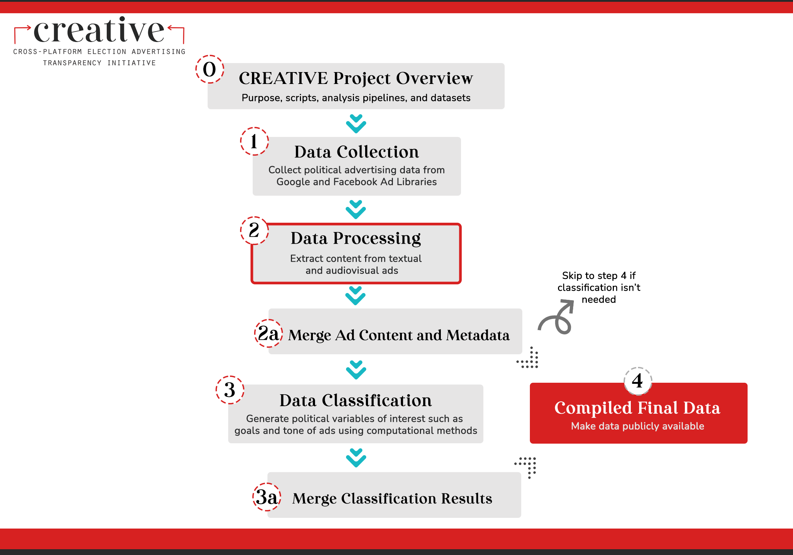

# Wesleyan Media Project - Image-Video-Data-Preparation

Welcome! This repository contains code that allows for selecting and preprocessing image and video data for the AWS Rekognition pipeline, as well as querying text ads data.

This repository is a part of the [Cross-platform Election Advertising Transparency Initiative (CREATIVE)](https://www.creativewmp.com/). CREATIVE has the goal of providing the public with analysis tools for more transparency of political ads across online platforms. In particular, CREATIVE provides cross-platform integration and standardization of political ads collected from Google and Facebook. CREATIVE is a joint project of the [Wesleyan Media Project (WMP)](https://mediaproject.wesleyan.edu/) and the [privacy-tech-lab](https://privacytechlab.org/) at [Wesleyan University](https://www.wesleyan.edu).

To analyze the different dimensions of political ad transparency we have developed an analysis pipeline. The scripts in this repo are part of the Data Processing Step in our pipeline.


## Table of Contents

- [1. Overview](#overview)
- [2. Setup](#setup)
- [3. Results Storage](#results-storage)
- [4. Thank You!](#thank-you)

## 1. Overview

This repository contains scripts for video and image data preprocessing through deduplication, ads content filtering (for image data), and video trimming (in order to economize computational resources). It also provides scripts which allow users to retrieve metadata for video and image ads from their Google BigQuery table and text ads from their MySQL table (set up during the data collection step [Facebook](https://github.com/Wesleyan-Media-Project/fb_agg_reports_import/tree/main), [Google](https://github.com/Wesleyan-Media-Project/google_ads_archive)). Additionally, a script that selects text ads data is also provided.

## 2. Setup

### 1. Install Relevant Software

Before running any of the code in this repo, make sure you have Python installed on your system. You can do so on the [official Python website](https://www.python.org/downloads/). In addition, install Jupyter Notebook by writing the following command in your terminal:

```bash
 pip install jupyter
```

From here, you should be able to run Jupyter Notebook by entering this command in your terminal:

```bash
jupyter notebook
```

### 2. Install Dependencies

Prior to running the scripts in this repo, please install the following dependency:

```bash
pip install pandas
```

### 3. Run the Scripts

The scripts should be run in number order, specifically meaning that `01-get-checksum-for-deduplication.ipynb` should be run prior to `02-filter-data-for-audiovisual-analysis.ipynb`.

Note that prior to running `01-get-checksum-for-deduplication.ipynb`, you will have to change the lines of code `video_source_path = 'my-video-dir' image_source_path = 'my-image-dir'` and `'def search_files(directory, filetype=None):'` to match up with your data directories and the filetype you are attempt to target.

In order to run the `trim-video.py` script, which may be done after running the previous two scripts, you will have to use the following bash code to get the ffmpeg value:

```bash
 export PATH=/software/ffmpeg:/software/ffmpeg/bin:$PATH
```

In addition, you will again have to make sure that the code referencing data directories matches up with your data directories. This is specifically in reference to the lines `video_dir = "my-video-directory"` and `truncated_video_dir = "my-trimmed-video-directory"`

**NOTE**: The query scripts located in `select-ad-metadata` are different from the other ones in this repo in that they are or contain an SQL script. It requires you to have a Google BigQuery and/or a local MySQL database set up. This is done in the Data Collection step.

## 3. Results Storage

When you run `01-get-checksum-for-deduplication.ipynb` and `02-filter-data-for-audiovisual-analysis.ipynb`, the results are saved in an `output` folder. The data will be in `csv` format.

The data created by `01-get-checksum-for-deduplication.ipynb` (saved as either `outfile.csv`, `google2022_video_info.csv` or `google2022_image_info'.csv`) contains the following fields: <br>

- `filepath`: the file path to get to the file being referenced <br>
- `filename`: the file name of the file being referenced <br>
- `checksum`: the checksum computed for the file being referenced <br>
- `filesize` (if table of image file information, not for video information table): filesize of the file being referenced

`02-filter-data-for-audiovisual-analysis.ipynb` refines the data created by `01-get-checksum-for-deduplication.ipynb`. The data returned is largely similar to that of `01-get-checksum-for-deduplication.ipynb`, but with deduplication, the extraction of ad_id's when relevant, and the exclusion of screenshot images done.

The data returned by `02-filter-data-for-audiovisual-analysis.ipynb` contains the following fields: <br>

- `filepath`: the file path to get to the file being referenced <br>
- `filename`: the file name of the file being referenced <br>
- `checksum`: the checksum computed for the file being referenced <br>
- `filesize` (if table of image file information, not for video information table): filesize of the file being referenced <br>
- `ad_id`: extracted ad ids from image files that are named following the ad it underline filetype structure.

The `trim-video.py` script results in truncated videos (each 2 minutes long) inside of truncated_video_dir (your local path to save trimmed video files).

The `select-ad-metadata` folder stores three database query scripts. `get_fb_metadata_and_text_ads.R` and `get_google_text_ads.R` select and save query results tables into .csv files. The data returned by `get_google_metadata.sql` is a result table on Google BigQuery, which can be exported and saved into a .csv file.

The three query scripts in the `select-ad-metadata` folder select and save both text ads and metadata for all ads (including video and image ads) for Google and Facebook ads respectively. For Google ads, text ads and ads metadata are queried separately, one from MySQL via, the other from Google BigQuery. For Facebook ads, they are queried altogether from MySQL.

For Google ads:

- `select-ad-metadata/get_google_metadata.sql` is an SQL query selecting metadata fields for image and video data and as such it returns a result table.
- `select-ad-metadata/get_google_text_ads.R` selects text ads data fields from MySQL and save them into a csv file.

For Facebook ads:

- `select-ad-metadata/get_fb_metadata_and_text_ads.R` selects text ads as well as metadata information for all media types and save them into a csv file.

## 4. Thank You

<p align="center"><strong>We would like to thank our financial supporters!</strong></p><br>

<p align="center">This material is based upon work supported by the National Science Foundation under Grant Numbers 2235006, 2235007, and 2235008.</p>

<p align="center" style="display: flex; justify-content: center; align-items: center;">
  <a href="https://www.nsf.gov/awardsearch/showAward?AWD_ID=2235006">
    
  </a>
</p>

<p align="center">The Cross-Platform Election Advertising Transparency Initiative (CREATIVE) is a joint infrastructure project of the Wesleyan Media Project and privacy-tech-lab at Wesleyan University in Connecticut.

<p align="center" style="display: flex; justify-content: center; align-items: center;">
  <a href="https://www.creativewmp.com/">
    
  </a>
</p>

<p align="center" style="display: flex; justify-content: center; align-items: center;">
  <a href="https://mediaproject.wesleyan.edu/">
    
  </a>
</p>

<p align="center" style="display: flex; justify-content: center; align-items: center;">
  <a href="https://privacytechlab.org/" style="margin-right: 20px;">
    
  </a>
